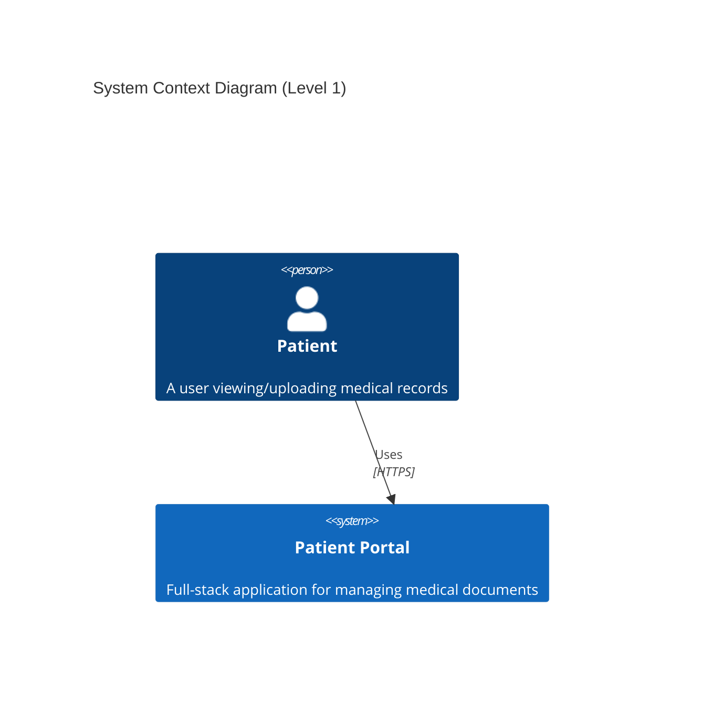
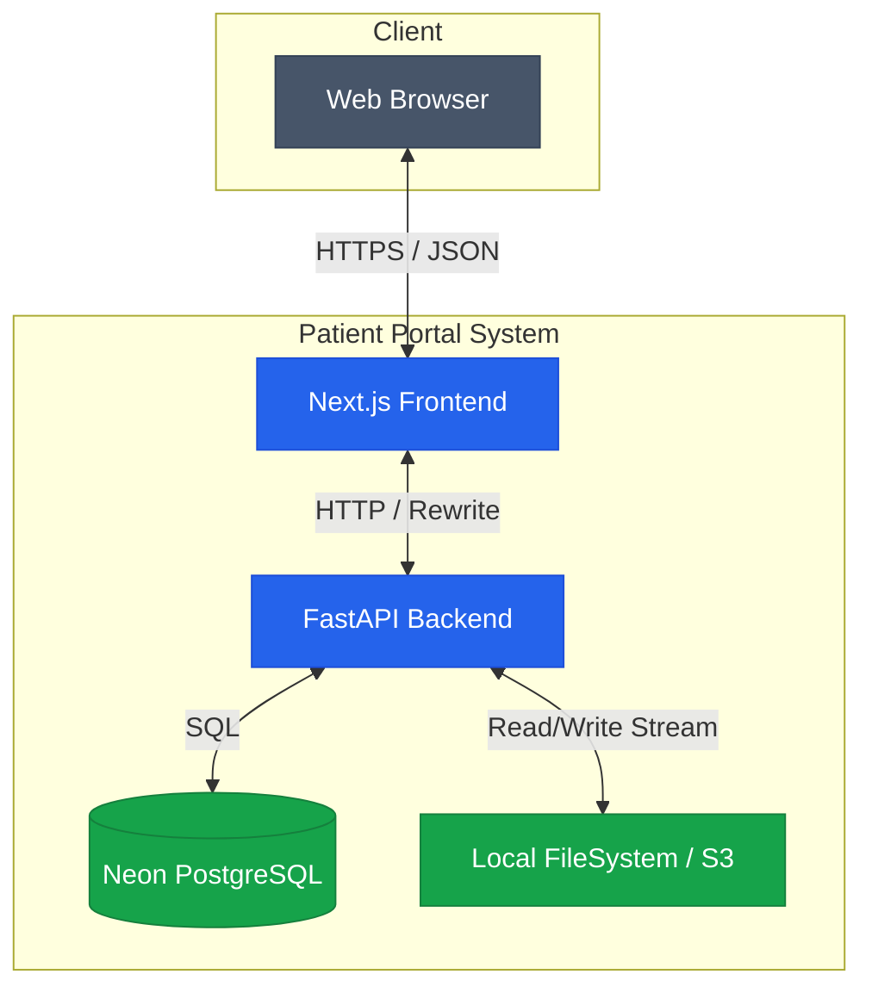
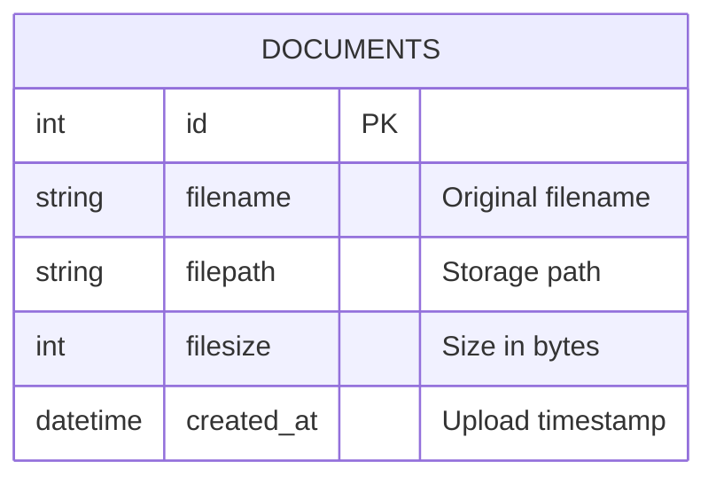
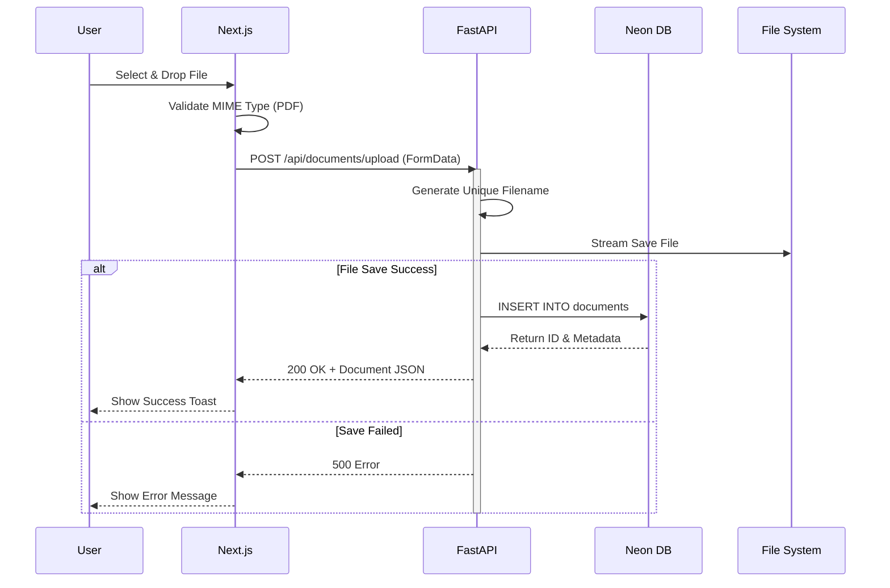
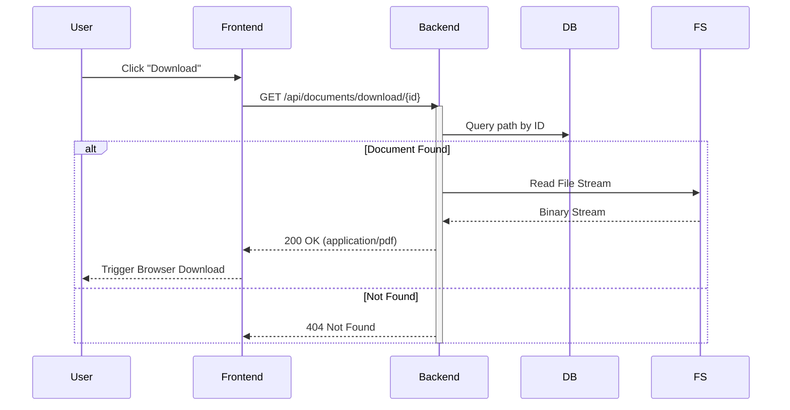
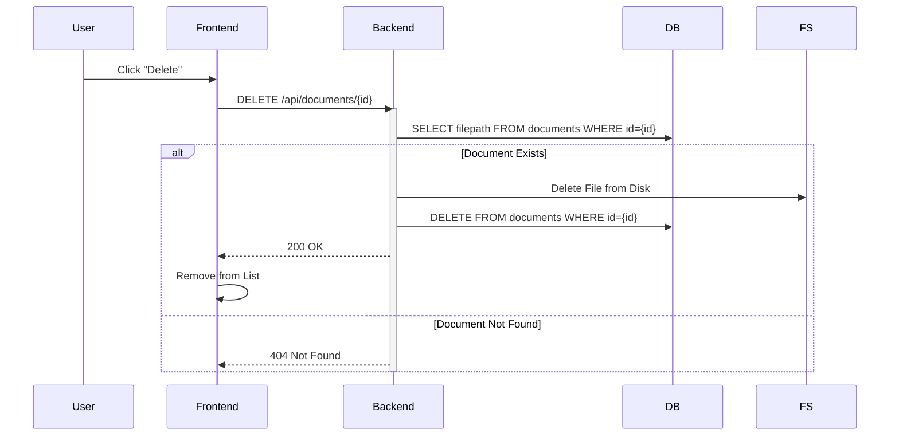

# Design Document - Patient Portal

## 1. Tech Stack Choices

### Q1. Frontend Framework
**Choice**: Next.js 16 (React)
**Reason**: 
- **Server-Side Rendering (SSR)** and **Client-Side Rendering (CSR)** capabilities provide a fast, SEO-friendly, and interactive user experience.
- **Built-in Routing**: The App Router makes file-based routing intuitive.
- **Vercel Integration**: User requirement to deploy on Vercel makes Next.js the natural choice.
- **TypeScript Support**: Native support helps catch errors early and ensures type safety across the app.

### Q2. Backend Framework
**Choice**: FastAPI (Python)
**Reason**:
- **Performance**: High performance (on par with NodeJS and Go) due to Starlette and Pydantic.
- **Type Safety**: Pydantic models ensure data validation and serialization is robust and easy to define.
- **Simplicity**: Very minimal boilerplate code required to set up specific routes compared to Django.
- **Documentation**: Automatic interactive API documentation (Swagger UI).
- **File Handling**: Excellent support for file uploads and streaming.

### Q3. Database
**Choice**: Neon (Serverless PostgreSQL)
**Reason**:
- **Cloud Native**: Perfect for Vercel deployments where persistent local storage is not available.
- **Scalability**: Separates storage and compute, scaling to zero when not in use.
- **Reliability**: PostgreSQL is a robust, ACID-compliant relational database standard.
- **Setup**: Zero maintenance required compared to hosting a VPS with Postgres.

### Q4. Scaling for 1,000 Users
To support 1,000 users, I would consider:
1. **Cloud Storage**: Move file storage from local disk/ephemeral to AWS S3 or Google Cloud Storage.
2. **Authentication**: Implement Auth0 or NextAuth to secure user data so users only see their own files.
3. **Database Indexing**: Ensure standard indexes on `created_at` and `user_id` columns.
4. **CDN**: Serve static assets via Vercel's Edge Network.
5. **Rate Limiting**: Implement middleware in FastAPI to prevent abuse.

---

## 2. Architecture Overview



### 2.1 Container Diagram (Level 2)



---

## 3. Database Schema (ERD)



---

## 4. Interaction Flows (Sequence Diagrams)

### 4.1 Upload Workflow


### 4.2 Download Workflow


### 4.3 Delete Workflow


**Flow:**
1. **Frontend**: Handles UI state and user interactions.
2. **Proxy**: Next.js rewrites `/api/*` requests to the FastAPI backend running on port 8000 (local) or Serverless Function (Vercel).
3. **Backend**: Validates inputs, handles logic, interacts with DB and Filesystem.
4. **Database**: Stores metadata (filename, size, path).
5. **Storage**: Stores actual PDF blobs.

---

## 3. API Specification

### 1. Upload Document
- **URL**: `POST /api/documents/upload`
- **Description**: Uploads a PDF file and stores metadata.
- **Request**: `multipart/form-data` with `file` field.
- **Response**:
  ```json
  {
    "id": 1,
    "filename": "report.pdf",
    "filepath": "20251211_123456_report.pdf",
    "filesize": 1024,
    "created_at": "2025-12-11T12:00:00"
  }
  ```

### 2. List Documents
- **URL**: `GET /api/documents`
- **Description**: Retrieves a list of all uploaded documents.
- **Response**: Array of document objects (same structure as above).

### 3. Download Document
- **URL**: `GET /api/documents/download/:id`
- **Description**: Downloads the actual PDF file.
- **Response**: Binary file stream with `Content-Type: application/pdf`.

### 4. Delete Document
- **URL**: `DELETE /api/documents/:id`
- **Description**: Deletes the file from storage and removes metadata from DB.
- **Response**: `{ "message": "Document deleted successfully" }`

---

## 4. Data Flow Description (Q5)

**Upload Process:**
1. User drags a PDF to the dropzone.
2. Frontend checks MIME type (must be PDF).
3. Frontend sends `POST` request with `FormData`.
4. Backend receives file, validates type again.
5. Backend generates a unique filename (timestamp + uuid + original name).
6. Backend streams file to `uploads/` directory on disk.
7. Backend inserts record into `documents` table in Neon.
8. Backend returns the new document metadata.
9. Frontend adds new document to the list state.

**Download Process:**
1. User clicks "Download" button.
2. Frontend requests `GET /api/documents/download/:id`.
3. Backend looks up file path in DB using ID.
4. Backend verifies file exists on disk.
5. Backend returns `FileResponse`, streaming the file content to the client.
6. Browser handles the download/save dialog.

---

## 5. Assumptions (Q6)
1. **Single User**: No authentication implemented as per requirements ("assume one user").
2. **File Size**: files < 10MB (enforced by assumed intent, configurable in Nginx/FastAPI).
3. **Persistence (Vercel)**: On Vercel, the filesystem is ephemeral. Uploaded files will vanish after the lambda freezes/restarts. For a real app, S3 is mandatory. The DB (Neon) is persistent.
4. **Security**: Basic validation provided. No virus scanning.
